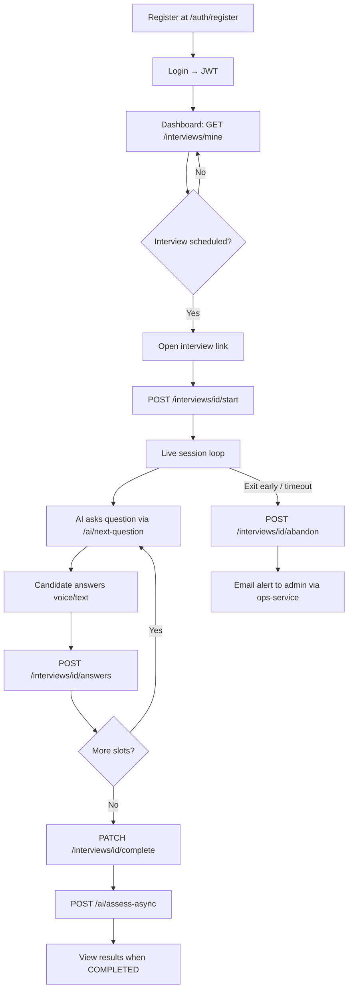
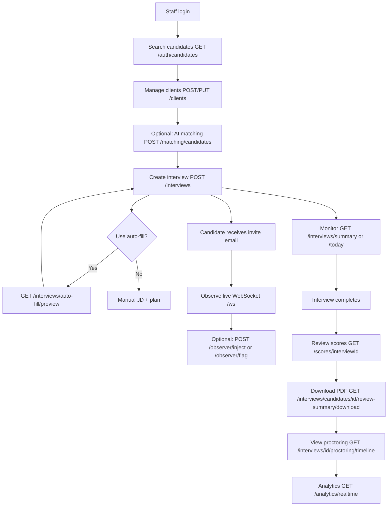
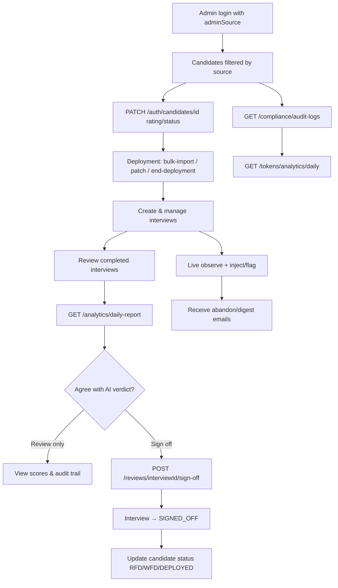
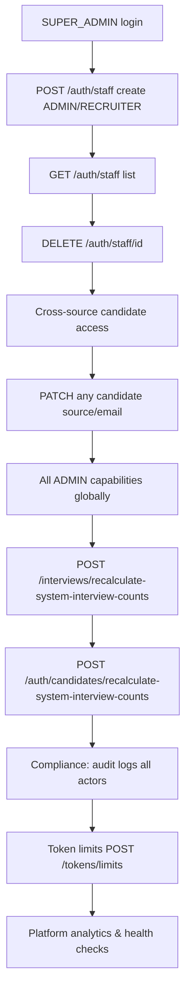
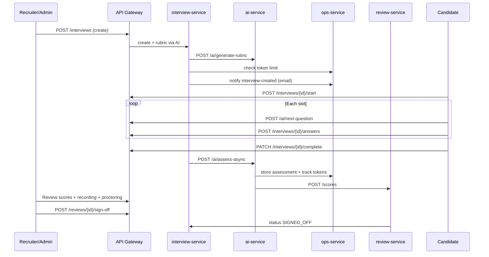
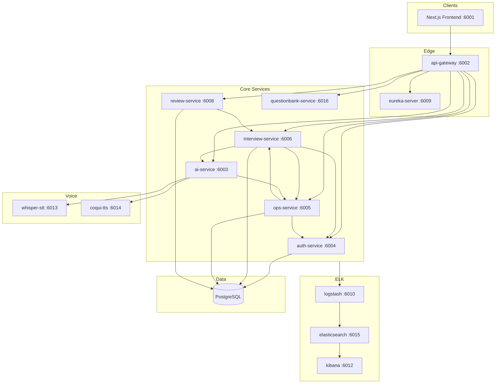
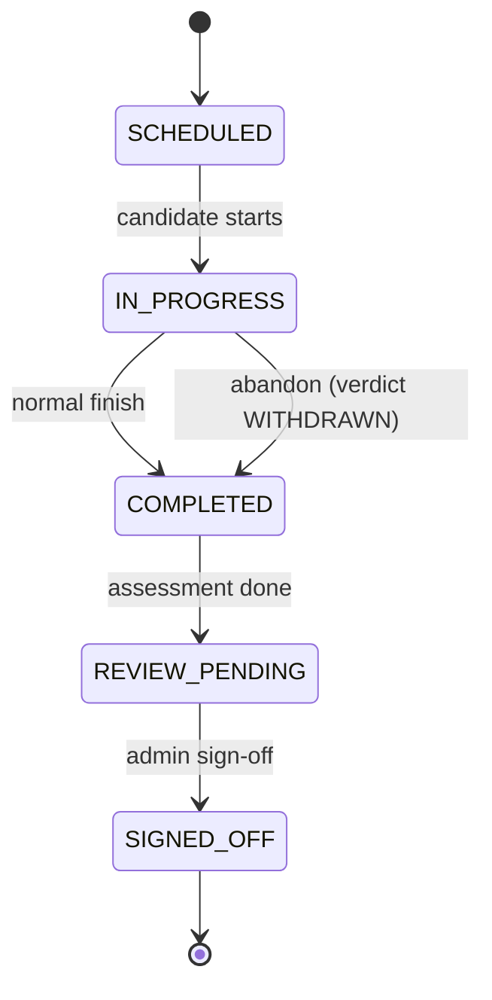
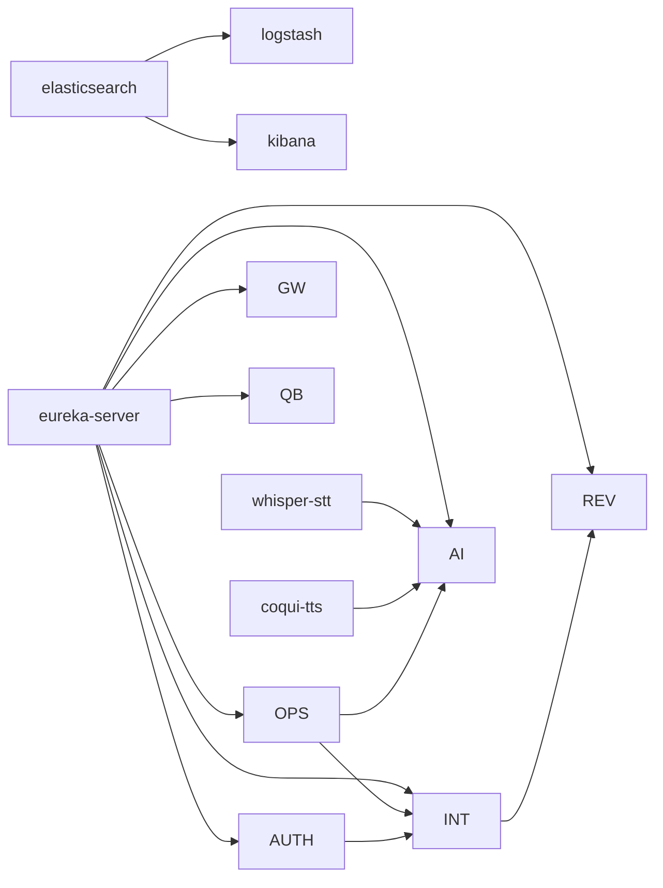

# Bench Readiness

AI-powered technical interview and bench-readiness platform. Candidates complete voice/text interviews; staff schedule sessions, review AI assessments, match candidates to clients, and manage deployment pipeline.

**Stack:** Spring Boot 3 microservices · Netflix Eureka · Spring Cloud Gateway · PostgreSQL · ELK · Faster-Whisper STT · Coqui TTS · Claude / Ollama LLMs · Next.js frontend (port 6001)

---

## Table of Contents

1. [Platform Features](#platform-features)
2. [Roles & Permissions](#roles--permissions)
3. [Role Workflows](#role-workflows)
4. [Interview Modes](#interview-modes)
5. [Architecture](#architecture)
6. [Services & Ports](#services--ports)
7. [Data Model & Status Flows](#data-model--status-flows)
8. [Docker Deployment](#docker-deployment)
9. [Local Development](#local-development)
10. [Configuration](#configuration)
11. [Related Documentation](#related-documentation)

---

## Platform Features

### Authentication & User Management (`auth-service`)

| Feature | Description |
|---------|-------------|
| Staff login | Email/password; role from account (`RECRUITER`, `ADMIN`, `SUPER_ADMIN`) |
| Candidate registration | Self-register with profile: batch, source, skill set, YOE, emails |
| Candidate login | Official or personal email + password |
| Forgot / reset password | 6-digit OTP email (10 min validity) |
| JWT (HS384) | Issued at login; gateway forwards `X-User-Id`, `X-User-Role`, `X-User-Email` |
| Admin source segregation | `BENCH` admin → B2B/BENCH candidates; `RECRUITMENT` admin → MARKET; `BD` → B2B only |
| Candidate search & profile | Filtered by admin source; rating, status, interview counts |
| Candidate bulk import | Excel upload with preview/confirm/download session |
| Deployment management | Bulk import, deployed list, patch/clear/end deployment, history |
| Resume upload | Per-candidate resume storage (staff) |
| Staff management | `SUPER_ADMIN` creates/lists/deletes `RECRUITER` and `ADMIN` accounts |
| Pipeline status API | Aggregated candidate pipeline metrics |

### Interviews (`interview-service`)

| Feature | Description |
|---------|-------------|
| Interview CRUD | Create, list, delete; modes SCREENING–L4 with slot plans |
| Auto-fill creation | Pre-populate JD/plan from candidate + client when `candidateId` provided |
| Token limit gate | Checks daily usage via `ops-service` before new interviews |
| Live interview | Start, record Q&A per slot, complete, abandon |
| Session recording | Chunked or full WebM upload; admin download |
| Proctoring | Events timeline, webcam snapshots, malpractice signals |
| JD & interview plans | Stored per interview; rubric generated at creation |
| Client management | CRUD, JD file upload, doc processing status |
| AI candidate–client matching | Per-candidate and per-client dashboards with refresh |
| Skill-based matching | Overview and per-client skill match scores |
| Resume intelligence | Upload, AI summary, bulk process, analytics |
| Recruiter bot | Natural-language query over interview/candidate data |
| PDF review summary | Download multi-interview candidate PDF |
| Analytics dashboard | Realtime, modes, verdicts, trends, candidate performance, daily report |
| Audit events | Logged to `ops-service` on create/complete/abandon |

### AI Engine (`ai-service`)

| Feature | Description |
|---------|-------------|
| Dynamic LLM provider | `claude` (default in Docker) or `ollama` via `APP_LLM_PROVIDER` |
| Next question | Mode-themed, JD-driven, difficulty-calibrated; question-bank integration |
| Four-stage assessment | Evidence → scoring → behavioral/resume → aggregated feedback |
| Async assessment | Background assess with status polling |
| Rubric generation | JD-specific categories + candidate profile at interview creation |
| AI matching | 5-weight candidate–JD scoring with safety caps; rule-based fallback |
| Manipulation detection | Prompt-injection patterns; warn/terminate thresholds |
| Speech-to-text | Faster-Whisper (`/v1/audio/transcriptions`) |
| Text-to-speech | Coqui TTS for bot voice |
| Code analysis | Optional code snippet evaluation endpoint |
| Resume summary | AI-generated resume digest |
| Recruiter chat | General AI chat for staff queries |
| Token tracking | Usage recorded in `ops-service` per operation |

### Operations (`ops-service` — merged compliance + observer)

| Feature | Description |
|---------|-------------|
| **Compliance** | Audit logs, retention policies, daily token limits, per-interview token summaries |
| **Token APIs** | Check limit, track usage, store/retrieve assessment JSON, finalize interview |
| **Observer** | WebSocket STOMP live feed `/topic/observer/{interviewId}` |
| **Live controls** | Inject follow-up question; flag suspicious answers |
| **Email** | Interview invite, abandon alert, cancellation, new-client notifications |
| **Daily digest** | Scheduled email report to admins (cron-configurable) |

### Review & Sign-off (`review-service`)

| Feature | Description |
|---------|-------------|
| Category scores | Stored per interview (from AI assessment) |
| Admin sign-off | Final verdict override; updates interview to `SIGNED_OFF` |
| Sign-off history | Reviewer, note, timestamp |

### Question Bank (`questionbank-service`)

| Feature | Description |
|---------|-------------|
| Questions, categories, tags | Curated question library |
| Companies & sessions | Organizational structure for practice/reuse |
| User/admin dashboards | QB-specific analytics |
| AI digest | Question-bank digest generation |
| Email | QB notification flows |

### Platform Infrastructure

| Feature | Description |
|---------|-------------|
| API Gateway | JWT validation, CORS, Eureka `lb://` routing, `/api/*` prefix strip |
| Eureka | Service discovery and health registry |
| ELK | Elasticsearch + Logstash + Kibana centralized logging |
| Jenkins CI | Build, push images, `docker compose up` deploy |

---

## Roles & Permissions

| Role | Scope | Key capabilities |
|------|-------|------------------|
| **CANDIDATE** | Own data only | Register, take interviews, view `/interviews/mine`, upload answers/recording |
| **RECRUITER** | All candidates (no source filter) | Create/delete interviews, clients, matching, analytics, observe live, recordings |
| **ADMIN** | Source-filtered candidates | Same as recruiter + sign-off, audit logs, daily report; `BENCH` or `RECRUITMENT` source |
| **SUPER_ADMIN** | Global | All admin powers + staff CRUD, cross-source candidate edit, system interview count recalc |

**Admin sources** (ADMIN role only):

| `adminSource` | Candidate sources managed |
|---------------|---------------------------|
| `BENCH` | B2B, BENCH |
| `BD` | B2B only |
| `RECRUITMENT` | MARKET |

Default seeded account: `admin@benchreadiness.com` / `Admin@123`

---

## Role Workflows

### Candidate Workflow



**Candidate journey summary**

1. Self-register with skill set, source, YOE, emails.
2. Receive interview invite email when staff creates an interview.
3. Start live interview; bot asks mode-specific questions (voice optional via STT/TTS).
4. Answers and optional recording/proctoring events are persisted per slot.
5. On completion, async AI assessment runs; verdict and feedback become available.
6. Early exit triggers abandon flow and admin notification.

---

### Recruiter Workflow



**Recruiter journey summary**

1. Login and search/manage candidates (all sources).
2. Maintain client records and JD documents.
3. Run AI matching to rank bench or market candidates for a client.
4. Schedule interviews (manual or auto-fill from candidate + client).
5. Optionally observe live session, inject questions, or flag answers.
6. After completion, review AI scores, recordings, proctoring, and export PDF summary.

---

### Admin Workflow (BENCH or RECRUITMENT)



**Admin journey summary**

1. Manage candidates within their source scope (BENCH vs MARKET).
2. Update ratings, pipeline status, deployment records.
3. Schedule and monitor interviews; receive email on abandon or daily digest.
4. Review AI assessment, proctoring, and token usage.
5. **Sign off** with final verdict (authoritative over AI suggestion).
6. Move ready candidates through RFD → WFD → DEPLOYED pipeline.

---

### Super Admin Workflow



**Super Admin journey summary**

1. Provision and deprovision staff accounts with correct `adminSource` for admins.
2. Full visibility across B2B, BENCH, and MARKET candidates.
3. Run system maintenance (interview count reconciliation).
4. Configure token limits and review platform-wide audit/compliance data.

---

### End-to-End Interview Lifecycle (All Roles)



---

## Interview Modes

| Mode | Purpose | Questions | Duration | Difficulty | READY threshold (avg) |
|------|---------|-----------|----------|------------|------------------------|
| **SCREENING** | Initial filter | 5 | 15 min | Easy | ≥ 3.0 |
| **L1** | Fundamentals | 7 | 20 min | Easy–Medium | ≥ 3.5 |
| **L2** | Applied knowledge | 8 | 25 min | Medium | ≥ 4.0 |
| **L3** | Senior / architecture | 10 | 30 min | Medium–Hard | ≥ 4.0 |
| **L4** | Staff / principal | 10 | 30 min | Hard | ≥ 4.5 |

Each mode uses themed question slots (communication, problem-solving, system design, etc.) calibrated by rubric and candidate profile.

---

## Architecture



### Repository layout

```
bench-readiness/
├── eureka-server/          # Service registry (6009)
├── api-gateway/            # JWT + routing (6002)
├── auth-service/           # Users, JWT, candidates (6004)
├── interview-service/      # Interviews, clients, analytics (6006)
├── ai-service/             # LLM, STT/TTS, assessment (6003)
├── ops-service/            # Compliance + observer merged (6005)
├── review-service/         # Scores + sign-off (6008)
├── questionbank-service/   # Question library (6016)
├── observer-service/       # Legacy — do not deploy alongside ops-service
├── compliance-service/     # Legacy — do not deploy alongside ops-service
├── elk/                    # Logstash pipelines
├── docker-compose.yml      # Production stack
└── AiInterviewBot/         # Next.js frontend (separate repo/path, port 6001)
```

> **Note:** `observer-service` and `compliance-service` were merged into `ops-service`. Do not run all three against the same database (shared Flyway advisory lock).

---

## Services & Ports

| Service | Port | Registry name | Responsibility |
|---------|------|---------------|----------------|
| Frontend | 6001 | — | Next.js UI |
| api-gateway | 6002 | `API-GATEWAY` | Routing, JWT, CORS |
| ai-service | 6003 | `AI-SERVICE` | Questions, assessment, matching, STT/TTS |
| auth-service | 6004 | `AUTH-SERVICE` | Auth, candidates, staff |
| ops-service | 6005 | `OPS-SERVICE` | Audit, tokens, email, WebSocket observer |
| interview-service | 6006 | `INTERVIEW-SERVICE` | Interviews, clients, analytics, proctoring |
| review-service | 6008 | `REVIEW-SERVICE` | Scores, sign-off |
| eureka-server | 6009 | — | Discovery dashboard |
| logstash | 6010 | — | Log ingestion |
| kibana | 6012 | — | Log UI |
| whisper-stt | 6013 | — | Faster-Whisper (container 8000) |
| coqui-tts | 6014 | — | TTS (container 5002) |
| elasticsearch | 6015 | — | Search/log store (container 9200) |
| questionbank-service | 6016 | `QUESTIONBANK-SERVICE` | Question bank API |

### Gateway route map

| Path prefix | Target service |
|-------------|----------------|
| `/api/auth/**`, `/auth/**` | auth-service |
| `/api/interviews/**`, `/clients/**`, `/analytics/**`, … | interview-service |
| `/api/ai/**`, `/ai/**` | ai-service |
| `/api/observer/**`, `/api/ws/**`, `/observer/**`, `/ws/**` | ops-service |
| `/api/compliance/**`, `/api/tokens/**`, `/compliance/**`, `/tokens/**` | ops-service |
| `/api/reviews/**`, `/api/scores/**`, `/reviews/**`, `/scores/**` | review-service |
| `/api/qb/**`, `/questionbank/**` | questionbank-service |

Public (no JWT): `/auth/login`, `/auth/register`, `/auth/refresh`, `/auth/forgot-password`, `/auth/reset-password`, `/auth/logout`, `/actuator/health`

---

## Data Model & Status Flows

### PostgreSQL schemas

| Schema | Service | Key tables |
|--------|---------|------------|
| `auth_svc` | auth-service | `users`, `password_reset_otps` |
| `interview_svc` | interview-service | `engineers`, `job_descriptions`, `interview_plans`, `interviews`, clients, proctoring |
| `observer_svc` | ops-service | `observer_events` |
| `compliance_svc` | ops-service | `audit_logs`, `token_usage`, `assessment_responses`, `interview_token_summary`, `daily_token_limits` |
| `review_svc` | review-service | `scores`, `sign_offs` |

### Interview status



### Readiness verdicts

`READY` · `NEEDS_1_WEEK_PREP` · `NEEDS_RESKILLING` · `MISMATCH_WITH_JD` · `WITHDRAWN`

### Candidate pipeline status

| Status | Meaning |
|--------|---------|
| **RFD** | Ready for deployment |
| **WFD** | Waiting for deployment |
| **DOB** | Deploy, observe on bill |
| **DEPLOYED** | Active client deployment (empId, client, mentor, dates) |

### Candidate sources

`B2B` · `BENCH` · `MARKET`

---

## Docker Deployment

Production stack is defined in `docker-compose.yml`. All application images are pulled from GitLab registry (`registry.gitlab.com/ty_optimize/optimize/`).

### Start order (dependency chain)



### Quick deploy

```bash
# Set secrets in .env (Claude key, DB, JWT, mail)
docker compose pull
docker compose up -d

# Verify
docker compose ps
curl -sf http://localhost:6013/docs || nc -z localhost 6013   # whisper-stt (OpenAPI UI or port open)
curl -sf http://localhost:6002/actuator/health  # gateway (via Eureka chain)
```

### Resource highlights

| Service | Memory limit | Notes |
|---------|--------------|-------|
| whisper-stt | 6 GB | `medium` model; 180s health `start_period` |
| coqui-tts | 2 GB | 180s health `start_period` |
| interview-service | 4 GB | Recording volume mounted |
| ai-service | 4 GB | Depends on whisper + coqui healthy |
| elasticsearch | 6 GB | Single-node, security disabled |

### Health checks

- **Java services:** TCP port check on service port
- **whisper-stt:** Python TCP probe on port 8000 (works with `/bin/sh`; no `curl`/`/health`)
- **coqui-tts:** TCP 5002
- **ELK:** Elasticsearch cluster health, Logstash API

---

## Local Development

### Prerequisites

- JDK 21, Maven 3.9+
- PostgreSQL 12+
- Node.js 18+ (frontend)
- Docker (for STT/TTS) or local Ollama/Claude API keys
- Gmail app password (email features in ops-service)

### Environment variables

Secrets are **not** stored in `application.yml`. Copy `.env.example` to `.env` (backend) or `.env.frontend.example` to `.env.local` (frontend).

Full reference: [docs/ENVIRONMENT.md](docs/ENVIRONMENT.md)

| Variable | Required by | Description |
|----------|-------------|-------------|
| `DB_USER` / `DB_PASSWORD` | All DB services | PostgreSQL credentials |
| `JWT_SECRET` | auth-service, api-gateway, others | Min 32 chars; shared across services |
| `JWT_ISSUER` / `JWT_AUDIENCE` | auth-service, api-gateway | Token issuer/audience validation (defaults provided) |
| `JWT_ACCESS_EXPIRY_MS` | auth-service | Access token lifetime (default 30 min) |
| `JWT_REFRESH_EXPIRY_MS` | auth-service | Refresh token lifetime (default 7 days) |
| `GATEWAY_SHARED_KEY` | api-gateway + all services | Shared secret; gateway stamps `X-Gateway-Key` on proxied requests |
| `MAIL_USERNAME` / `MAIL_PASSWORD` | auth-service, ops-service, questionbank | SMTP for OTP and notifications |

**Production:** use `.env.prod.example` as a template; rotate credentials that were previously committed.

### API contracts

Backend OpenAPI specs are the source of truth for frontend types. See [docs/api/CONTRACTS.md](docs/api/CONTRACTS.md).

| Service | Swagger UI |
|---------|------------|
| auth-service | http://localhost:6004/swagger-ui.html |
| questionbank-service | http://localhost:6016/swagger-ui.html |

Contract snapshot: `contracts/auth-public-api.json` (validated by `AuthApiContractTest`).

### CI security

GitHub Actions runs `mvn verify` and OWASP dependency-check (fails on CVSS ≥ 9). Dependabot opens weekly dependency PRs.

### Build

```bash
mvn clean install -DskipTests
```

### Run services (order)

1. PostgreSQL + schemas (Flyway auto-migrates per service)
2. `eureka-server` → `api-gateway`
3. `auth-service` → `ops-service`
4. `whisper-stt` + `coqui-tts` (Docker) or configure external URLs
5. `interview-service` → `ai-service` → `review-service` → `questionbank-service`

```bash
# Example per service
cd eureka-server && mvn spring-boot:run
```

Or full stack:

```bash
docker compose up -d
```

### Test media services

```bash
test-stt-tts.bat   # Windows: checks :6013/health and TTS
```

---

## Configuration

### Core environment variables (Docker / `.env`)

```bash
# LLM (docker-compose defaults to Claude)
APP_LLM_PROVIDER=claude
APP_CLAUDE_API_KEY=<your-key>
APP_CLAUDE_MODEL=claude-haiku-4-5
APP_CLAUDE_ASSESSMENT_MODEL=claude-sonnet-4-5

# Ollama alternative
APP_OLLAMA_BASE_URL=http://103.182.211.219:11434
APP_OLLAMA_QUESTION_MODEL=qwen2.5:7b
APP_OLLAMA_ASSESSMENT_MODEL=qwen2.5:32b

# Speech
APP_MEDIA_STT_PROVIDER=faster-whisper
APP_MEDIA_WHISPER_URL=http://whisper-stt:8000
APP_MEDIA_COQUI_URL=http://coqui-tts:5002

# Auth
JWT_SECRET=<min-32-chars>

# Email (ops-service)
MAIL_USERNAME=
MAIL_PASSWORD=
INTERVIEW_BASE_URL=http://localhost:6001/interview
```

### Switch LLM at runtime

See [DYNAMIC_LLM_SWITCHING.md](./DYNAMIC_LLM_SWITCHING.md) and [AI_MODEL_CONFIGURATION.md](./AI_MODEL_CONFIGURATION.md).

---

## Related Documentation

| Document | Topic |
|----------|-------|
| [DEPLOYMENT_GUIDE.md](./DEPLOYMENT_GUIDE.md) | Jenkins pipeline, server deploy |
| [ELK-SETUP.md](./ELK-SETUP.md) | Logging stack |
| [AI_MODEL_CONFIGURATION.md](./AI_MODEL_CONFIGURATION.md) | Claude/Ollama models |
| [DYNAMIC_LLM_SWITCHING.md](./DYNAMIC_LLM_SWITCHING.md) | Runtime provider switch |
| [DAILY_DIGEST_REPORTING.md](./DAILY_DIGEST_REPORTING.md) | Scheduled admin digest |
| [INTERVIEW_MALPRACTICE_REPORTING.md](./INTERVIEW_MALPRACTICE_REPORTING.md) | Proctoring & malpractice |
| [AI_PROMPTS_DOCUMENTATION.md](./AI_PROMPTS_DOCUMENTATION.md) | LLM prompt reference |
| [RESOURCE_ANALYSIS_100_USERS.md](./RESOURCE_ANALYSIS_100_USERS.md) | Capacity planning |

---

## License

Internal TY Optimize / Bench Readiness platform.
